This technical blueprint outlines the architecture for **Hybrid Vault (V1)**. All naming conventions adhere to the "Safe Lexicon" to ensure platform evasion.

### 1. System Architecture Diagram

```mermaid
graph TD
    subgraph "Telegram Interface (Frontend/Pager)"
        Bot[Telegram Bot] -- "/seller <id>" --> BotLogic[Bot Logic]
        BotLogic -- "Generate Token" --> Backend
        BotLogic -- "DM Notifications" --> User[Users]
    end

    subgraph "Web Engine (Vercel Serverless)"
        WebUI[Next.js / Tailwind] -- "Telegram Login" --> Auth[Supabase Auth]
        WebUI -- "Search Token" --> API[Vercel API Functions]
        API -- "Async Polling" --> WebUI
    end

    subgraph "Data Layer (Supabase)"
        DB[(PostgreSQL)]
        RLS[Row Level Security]
        WH[Supabase Webhooks]
    end

    %% Data Flow
    API <--> RLS
    RLS <--> DB
    WH -- "Payment Confirmed" --> BotLogic
    
    %% Constraints
    BotLogic -- "6-Digit Token (No URLs)" --> User
    User -- "Manual Search" --> WebUI
```



---

### 2. Project Folder Structure

```text
hybrid-vault/
├── telegram-bot/              # Node.js / Telegraf.js
│   ├── src/
│   │   ├── commands/          # /start, /seller
│   │   ├── middleware/        # ToS Validation
│   │   └── index.ts           # Bot Entry Point
│   └── package.json
├── web-engine/                # Next.js (App Router)
│   ├── app/
│   │   ├── login/             # Telegram Widget integration
│   │   ├── vault/             # Search & Briefcase Dashboard
│   │   │   └── [token]/       # Dynamic route for the Briefcase
│   │   └── api/               # Vercel Serverless Functions
│   │       ├── briefcase/     # GET/POST for token management
│   │       └── verify/        # Async payment status checks
│   ├── components/            # Decryption Matrix UI, Timer
│   └── lib/                   # Supabase Client
└── supabase/
    ├── migrations/             # SQL Schema & RLS Policies
    └── functions/             # Edge Functions for Webhooks
```

---

### 3. Core Backend Scaffolding

#### A. Supabase Schema & RLS (Cycle 2)
The schema uses the "Safe Lexicon" to mask the nature of the transactions.

```sql
-- Enable UUIDs and Extensions
CREATE EXTENSION IF NOT EXISTS "pgcrypto";

-- The Briefcase (The Escrow Table)
CREATE TABLE briefcases (
  id UUID PRIMARY KEY DEFAULT gen_random_uuid(),
  token TEXT UNIQUE NOT NULL, -- The 6-digit Alphanumeric Token
  left_hand_id BIGINT NOT NULL, -- Seller
  right_hand_id BIGINT NOT NULL, -- Buyer
  access_keys TEXT, -- The Digital Assets
  amount DECIMAL(12,2),
  fee_amount DECIMAL(12,2),
  status TEXT DEFAULT 'pending', -- 'pending', 'funded', 'completed'
  created_at TIMESTAMPTZ DEFAULT now()
);

-- ROW LEVEL SECURITY (RLS)
ALTER TABLE briefcases ENABLE ROW LEVEL SECURITY;

-- Policy: Only the two involved parties can view or edit the briefcase
CREATE POLICY "Briefcase Access Policy" ON briefcases
FOR ALL USING (
  auth.uid()::text = left_hand_id::text OR 
  auth.uid()::text = right_hand_id::text
);

-- Function to generate 6-digit token
CREATE OR REPLACE FUNCTION generate_briefcase_token() 
RETURNS TEXT AS $$
BEGIN
  RETURN upper(substring(md5(random()::text) from 1 for 6));
END;
$$ LANGUAGE plpgsql;
```

#### B. Telegram Bot Command Logic (Cycle 1)
Implemented using `telegraf.js`. Note the total absence of URLs.

```typescript
// telegram-bot/src/commands/handshake.ts
import { Telegraf } from 'telegraf';
import { supabase } from '../lib/supabase';

const bot = new Telegraf(process.env.BOT_TOKEN!);

bot.command('seller', async (ctx) => {
  const targetId = ctx.message.text.split(' ')[1];
  const rightHandId = ctx.from.id;

  if (!targetId) return ctx.reply("Usage: /seller <id>");

  // 1. Validate if Left_hand exists in DB
  const { data: leftHand } = await supabase
    .from('users')
    .select('id')
    .eq('telegram_id', targetId)
    .single();

  if (!leftHand) return ctx.reply("Left_hand is not registered.");

  // 2. Send Acceptance Prompt to Left_hand
  await ctx.telegram.sendMessage(targetId, 
    `A Right_hand wants to open a Briefcase. Accept?`, 
    { reply_markup: { inline_keyboard: [[{ text: "Accept", callback_data: `acc_${rightHandId}` }]] } }
  );
});

bot.action(/acc_(.+)/, async (ctx) => {
  const rightHandId = ctx.match[1];
  const leftHandId = ctx.from.id;

  // Create Briefcase record
  const { data, error } = await supabase.from('briefcases').insert({
    left_hand_id: leftHandId,
    right_hand_id: rightHandId,
    token: generateBriefcaseToken() // calls the SQL function
  }).select();

  const token = data[0].token;
  
  // Notify both parties without sending a URL
  await ctx.reply(`Briefcase created. Token: ${token}. Search this on the Web Engine.`);
  await ctx.telegram.sendMessage(rightHandId, `Briefcase created. Token: ${token}. Search this on the Web Engine.`);
});
```

#### C. Vault Execution API (Cycle 3 & 4)
Handling the asset lock and the 5% fee calculation.

```typescript
// web-engine/app/api/briefcase/route.ts
import { createClient } from '@supabase/supabase-js';

export async function POST(req: Request) {
  const { token, accessKeys, amount } = await req.json();
  const supabase = createClient(process.env.SUPABASE_URL!, process.env.SUPABASE_KEY!);

  // Calculate 5% fee
  const fee = amount * 0.05;
  const finalAmount = amount - fee;

  const { data, error } = await supabase
    .from('briefcases')
    .update({ 
      access_keys: accessKeys, 
      amount: amount, 
      fee_amount: fee 
    })
    .eq('token', token);

  if (error) return new Response(JSON.stringify({ error: "Vault Error" }), { status: 400 });
  return new Response(JSON.stringify({ success: true, fee }));
}
```

#### D. Async Verification Flow (Cycle 4)
To evade Vercel's 10s timeout, the backend returns a "Processing" state, and the frontend polls.

```typescript
// web-engine/app/api/verify/route.ts
export async function GET(req: Request) {
  const { searchParams } = new URL(req.url);
  const token = searchParams.get('token');

  // Check transaction status (Crypto/Fiat) asynchronously
  const { data } = await supabase
    .from('briefcases')
    .select('status')
    .eq('token', token)
    .single();

  return new Response(JSON.stringify({ 
    status: data.status, // 'pending' or 'funded'
    matrix: data.status === 'funded' ? decryptMatrix(data.access_keys) : null 
  }));
}

// Frontend Polling Logic (React snippet)
const verifyPayment = async () => {
  setLoading(true);
  let attempts = 0;
  const interval = setInterval(async () => {
    const res = await fetch(`/api/verify?token=${token}`);
    const data = await res.json();
    if (data.status === 'funded' || attempts > 10) {
      clearInterval(interval);
      setUnlocked(true);
    }
    attempts++;
  }, 3000); // Poll every 3 seconds for 30 seconds
};
```

#### E. Notification Webhook (Cycle 5)
Triggered by Supabase when the `status` column changes to `completed`.

```typescript
// supabase/functions/notify-bot/index.ts
Deno.serve(async (req) => {
  const { record } = await req.json();

  // Ping Telegram Bot API
  await fetch(`https://api.telegram.org/bot${BOT_TOKEN}/sendMessage`, {
    method: 'POST',
    body: JSON.stringify({
      chat_id: record.right_hand_id,
      text: `Briefcase ${record.token} is now open. Access Keys revealed.`
    })
  });

  return new Response("Notified", { status: 200 });
});
```